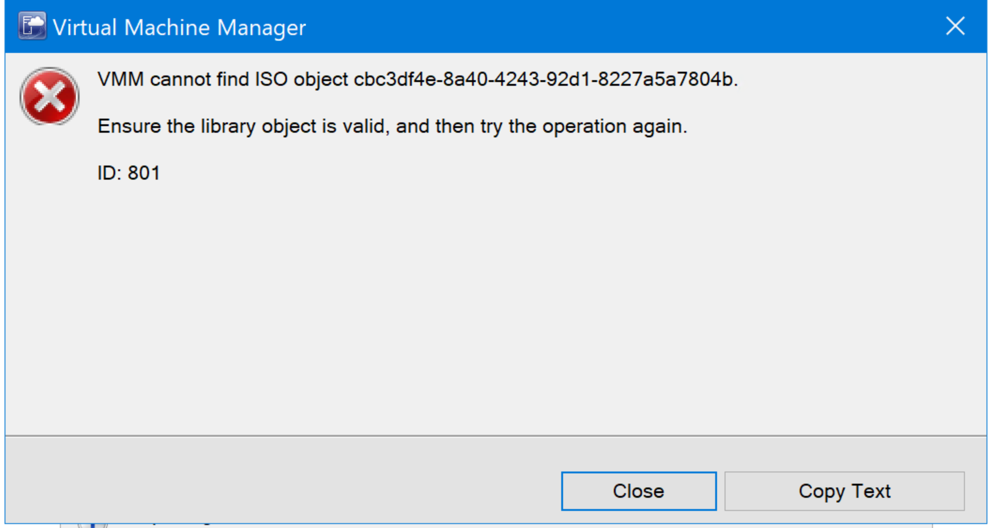
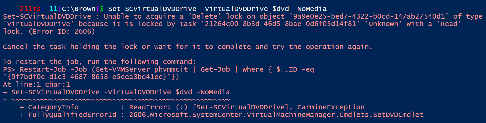
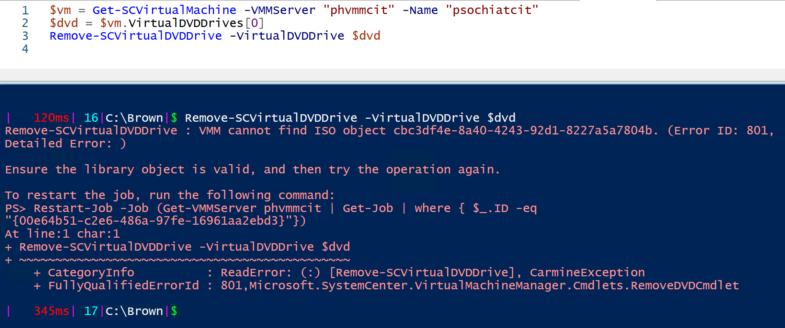
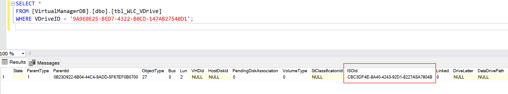
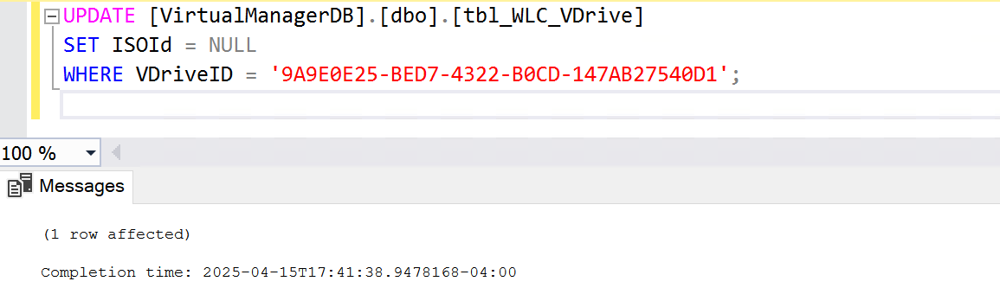
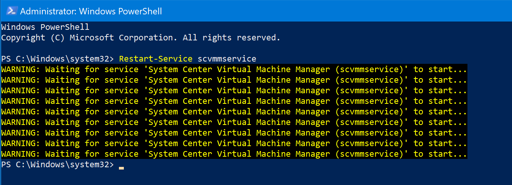

# 🛠️ KB Article: Fixing "VMM Cannot Find ISO Object" – Unrepairable VM in SCVMM

## Issue Summary

A VM (`psochiatcit`) entered an **unrepairable state** in SCVMM. Any attempt to repair the VM resulted in the following error:

> **Error ID: 801**  
> _"VMM cannot find ISO object `cbc3df4e-8a40-4243-92d1-8227a5a7804b`."_

## 

## Troubleshooting & Resolution Steps

### 1. Initial Repair Attempts Failed

ISO was there on the library
Refreshed the library, no success
Attempts to repair the VM in SCVMM repeatedly failed with the ISO object error.

---

### 2. Tried Removing DVD Drive via Hyper-V + Failover Cluster Manager

Logged into the Hyper-V host and removed the DVD drive from Failover Cluster Manager — **had no effect**.

---

### 3. PowerShell Attempt Failed with Same ISO Error

Tried running the following PowerShell command:

```powershell
$vm = Get-SCVirtualMachine -VMMServer "phvmmcit" -Name "psochiatcit"
$dvd = $vm.VirtualDVDDrives[0]
Set-SCVirtualDVDDrive -VirtualDVDDrive $dvd -NoMedia
```

This resulted in the same Error ID: 801, indicating VMM still couldn’t resolve the ISO reference but it gave me the exact object ID which I need to target when working directly with the SQL



I just tried giving another try by removing the DVD all together but it also didn't work

```powershell
Remove-SCVirtualDVDDrive -VirtualDVDDrive $dvd
```



---

### 4. Identified the Problem

SCVMM had lost the reference to the ISO file. Even though file was there on the Library Server and even refreshing the library server didn't fix the issue.

> **Error Message:**  
> _VMM cannot find ISO object `cbc3df4e-8a40-4243-92d1-8227a5a7804b`_

---

### 5. Located the Problematic ISO Reference in SQL

Used the following SQL query to identify the DVD drive and the broken ISO reference:

```sql
SELECT *
FROM [VirtualManagerDB].[dbo].[tbl_WLC_VDrive]
WHERE VDriveID = '9A9E0E25-BED7-4322-B0CD-147AB27540D1';
```



This returned a record containing the ISOId, confirming the ISO reference was still present in the DB.

### 6. Cleared the ISO Reference Manually

To clear the ISO reference, ran this update query in SQL Management Studio:

```sql
UPDATE [VirtualManagerDB].[dbo].[tbl_WLC_VDrive]
SET ISOId = NULL
WHERE VDriveID = '9A9E0E25-BED7-4322-B0CD-147AB27540D1';
```



This removed the broken link to the missing ISO file from the virtual DVD drive.

### 7. Restarted the VMM Service to Clear the Cache

VMM caches VM configuration data in memory. So after clearing the ISO from the DB, it was necessary to restart the SCVMM service on the VMM management server:

```powershell
Restart-Service scvmmservice
```

This action disconnects SCVMM clients temporarily. Ensure no other jobs are running before restarting the service. It will take 30 seconds for it to come back.

